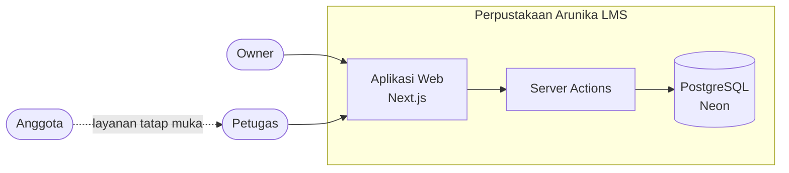
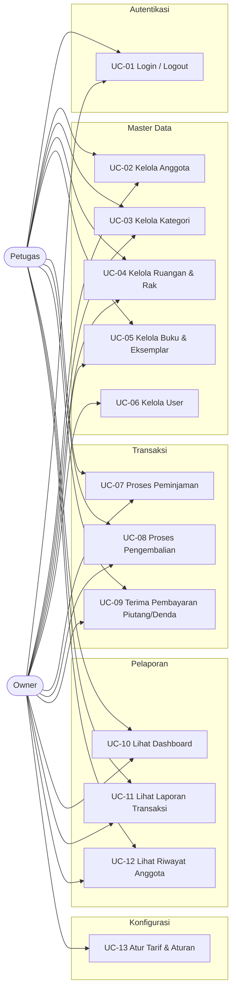
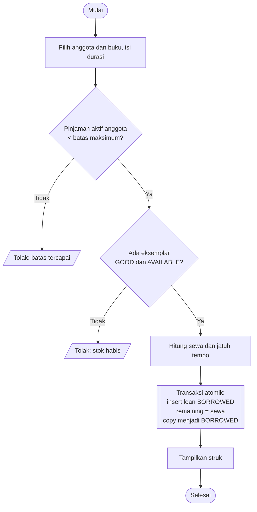
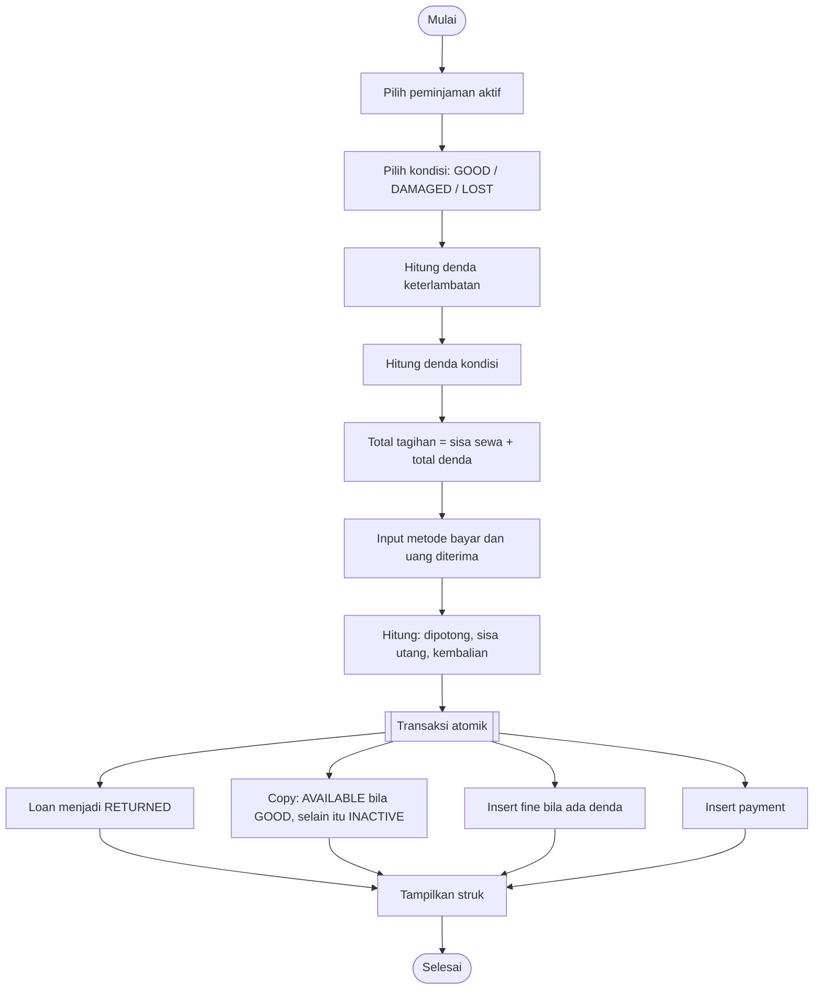
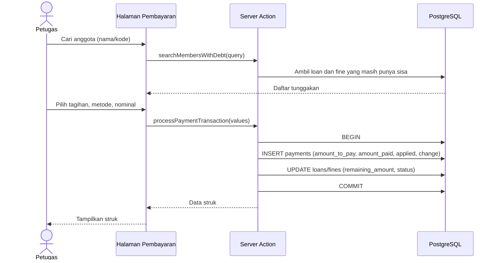
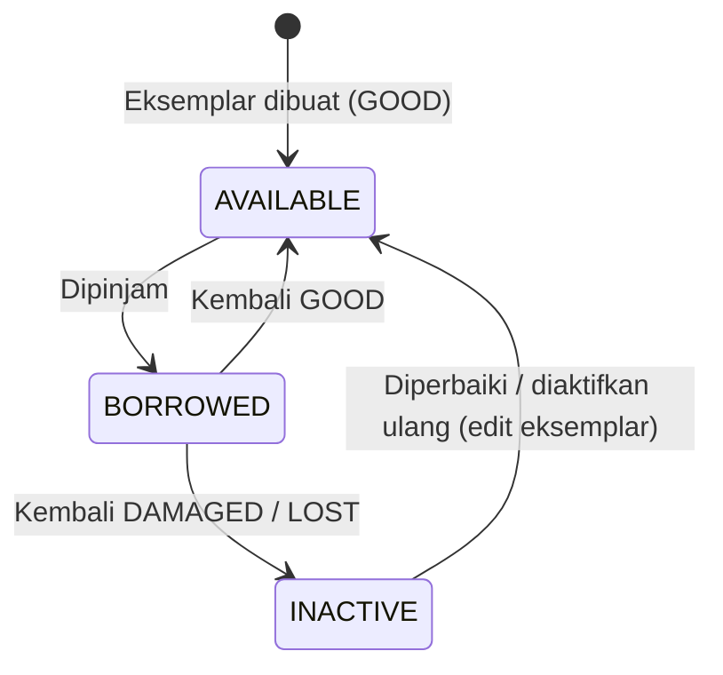
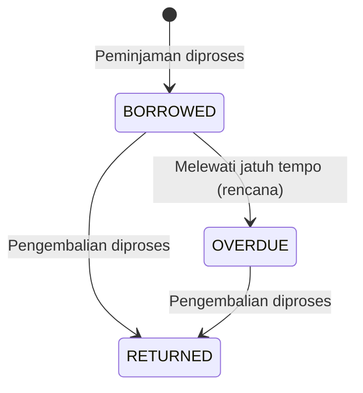
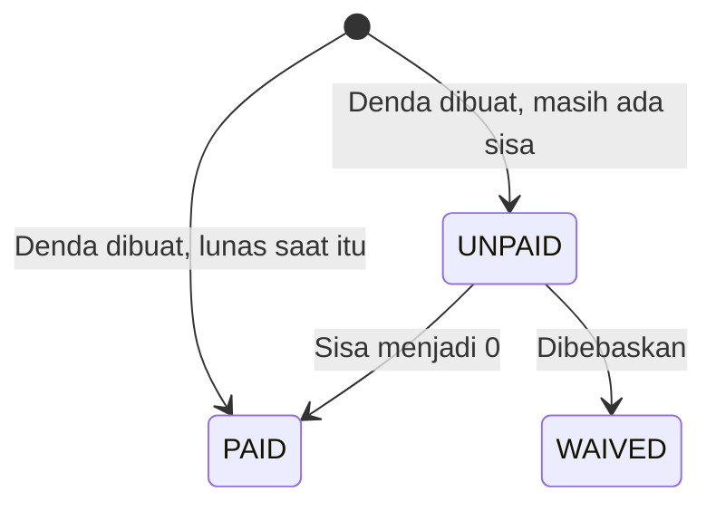
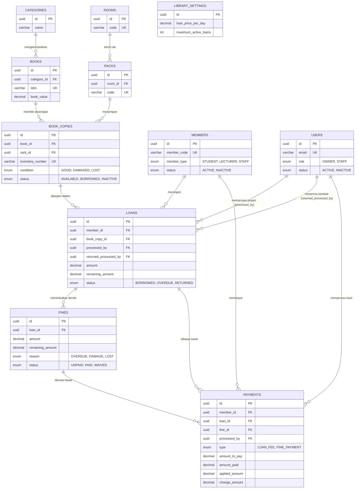
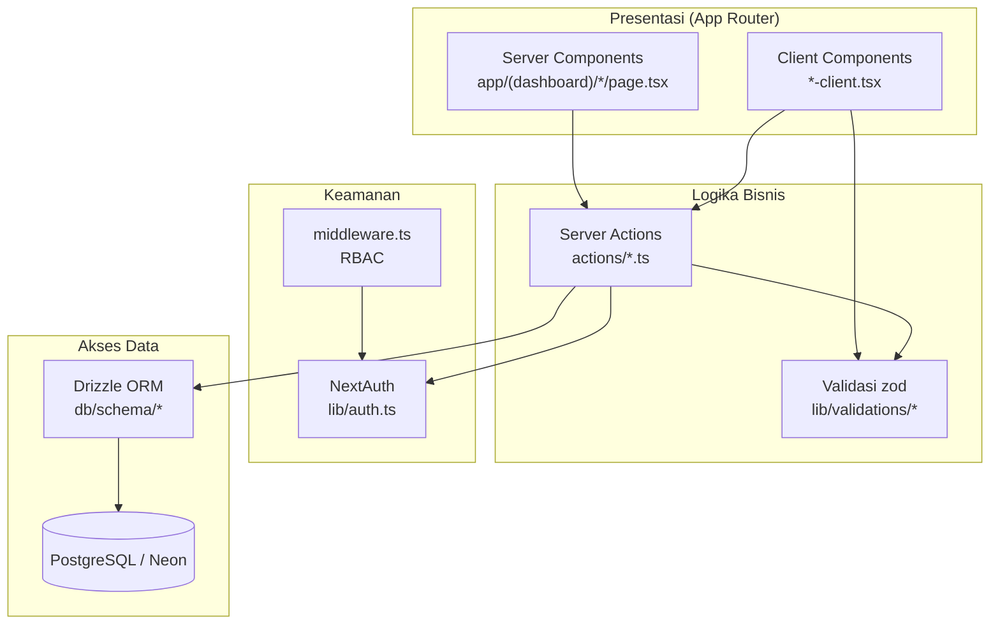

# Software Requirements Specification (SRS)

## Perpustakaan Arunika — Library Management System

|                   |                                                                                                   |
| ----------------- | ------------------------------------------------------------------------------------------------- |
| **Versi dokumen** | 1.0                                                                                               |
| **Tanggal**       | 5 Oktober 2026                                                                                    |
| **Status**        | Final (untuk portofolio)                                                                          |
| **Penulis**       | Fadillah Maulana (FadCode)                                                                        |
| **Repositori**    | [fcodestd-io/library-management-system](https://github.com/fcodestd-io/library-management-system) |

> **Catatan:** "Perpustakaan Arunika" adalah perpustakaan swasta **fiktif** yang dibuat sebagai studi kasus portofolio. Seluruh data, tarif, dan skenario operasional dalam dokumen ini adalah rekaan. Dokumen disusun mengacu pada struktur IEEE 830 / ISO/IEC/IEEE 29148 dan mencerminkan perilaku sistem pada kode saat ini.

---

## Daftar Isi

1. [Pendahuluan](#1-pendahuluan)
2. [Latar Belakang Masalah: Sistem Manual vs Solusi](#2-latar-belakang-masalah-sistem-manual-vs-solusi)
3. [Deskripsi Umum](#3-deskripsi-umum)
4. [Aktor dan Peran](#4-aktor-dan-peran)
5. [Use Case](#5-use-case)
6. [Kebutuhan Fungsional](#6-kebutuhan-fungsional)
7. [Aturan Bisnis dan Perhitungan](#7-aturan-bisnis-dan-perhitungan)
8. [Alur Proses](#8-alur-proses)
9. [Struktur Basis Data](#9-struktur-basis-data)
10. [Spesifikasi Laporan](#10-spesifikasi-laporan)
11. [Kebutuhan Antarmuka](#11-kebutuhan-antarmuka)
12. [Kebutuhan Non-Fungsional](#12-kebutuhan-non-fungsional)
13. [Arsitektur dan Teknologi](#13-arsitektur-dan-teknologi)
14. [Keterbatasan Saat Ini dan Rencana Pengembangan](#14-keterbatasan-saat-ini-dan-rencana-pengembangan)
15. [Matriks Keterlacakan](#15-matriks-keterlacakan)
16. [Lampiran](#16-lampiran)

---

## 1. Pendahuluan

### 1.1 Tujuan

Dokumen ini menjelaskan kebutuhan perangkat lunak untuk **Perpustakaan Arunika Library Management System**, sebuah aplikasi web untuk mengelola katalog buku, keanggotaan, peminjaman berbayar, pengembalian, denda, pembayaran kasir, dan pelaporan keuangan. Pembaca yang dituju: pengembang, penguji, pemilik perpustakaan (stakeholder), dan reviewer portofolio.

### 1.2 Ruang Lingkup

Sistem digunakan di lingkungan satu perpustakaan swasta dengan model **sewa buku berbayar per hari**. Cakupan:

**Termasuk (in scope)**

- Autentikasi petugas dan pembatasan akses berdasarkan peran.
- Manajemen master data: anggota, kategori, ruangan, rak, buku, eksemplar, dan user.
- Transaksi peminjaman, pengembalian, dan pembayaran piutang/denda (termasuk cicilan).
- Perhitungan otomatis sewa, denda keterlambatan, denda buku rusak, dan denda buku hilang.
- Dashboard operasional dan laporan keuangan.
- Pengaturan tarif dan aturan perpustakaan.

**Tidak termasuk (out of scope)**

- Portal mandiri anggota (anggota tidak login ke sistem).
- Pemesanan/reservasi buku, perpanjangan pinjaman online.
- Integrasi payment gateway; metode QRIS/transfer hanya dicatat sebagai metode pembayaran.
- Notifikasi otomatis (WhatsApp/email) dan pemindaian barcode.
- Aplikasi mobile native.

### 1.3 Definisi, Akronim, dan Singkatan

| Istilah                       | Arti                                                                           |
| ----------------------------- | ------------------------------------------------------------------------------ |
| **SRS**                       | Software Requirements Specification                                            |
| **RBAC**                      | Role-Based Access Control                                                      |
| **Eksemplar (copy)**          | Satu unit fisik dari sebuah judul buku, punya nomor inventaris sendiri         |
| **Sewa**                      | Biaya peminjaman = tarif per hari × lama pinjam                                |
| **Piutang sewa**              | Sewa yang belum dibayar anggota (`loans.remaining_amount`)                     |
| **Denda**                     | Tagihan tambahan: keterlambatan (`OVERDUE`), rusak (`DAMAGE`), hilang (`LOST`) |
| **Cicilan / partial payment** | Pembayaran sebagian dari sisa tagihan                                          |
| **Applied amount**            | Bagian uang yang dipotongkan ke tagihan (bukan kembalian)                      |
| **Server Action**             | Fungsi server Next.js yang dipanggil langsung dari komponen UI                 |

### 1.4 Referensi

- IEEE Std 830-1998 dan ISO/IEC/IEEE 29148:2018.
- Kode sumber: `db/schema/*`, `actions/*`, `lib/validations/*`, `middleware.ts`.

### 1.5 Gambaran Dokumen

Bagian 2 menjelaskan masalah sistem manual dan solusinya. Bagian 3–5 menjelaskan konteks, aktor, dan use case. Bagian 6–8 memuat kebutuhan fungsional, aturan bisnis, dan alur proses. Bagian 9 memuat struktur basis data. Bagian 10–13 memuat laporan, antarmuka, kebutuhan non-fungsional, dan arsitektur. Bagian 14–16 memuat keterbatasan, matriks keterlacakan, dan lampiran.

---

## 2. Latar Belakang Masalah: Sistem Manual vs Solusi

Sebelum sistem ini, Perpustakaan Arunika (fiktif) mencatat seluruh transaksi di **buku besar kertas dan lembar spreadsheet terpisah**. Berikut masalah yang muncul dan bagaimana sistem menyelesaikannya.

### 2.1 Perbandingan Masalah dan Solusi

| #   | Proses                 | Masalah pada sistem manual                                                                                            | Dampak                                                        | Solusi pada sistem                                                                                                            | Kebutuhan terkait               |
| --- | ---------------------- | --------------------------------------------------------------------------------------------------------------------- | ------------------------------------------------------------- | ----------------------------------------------------------------------------------------------------------------------------- | ------------------------------- |
| P1  | Pencatatan anggota     | Data anggota tersebar di buku register; tidak ada kode unik, nama kembar sulit dibedakan                              | Salah identifikasi peminjam                                   | Kode anggota unik otomatis (`memberCode`) dan pencarian cepat berdasarkan nama/kode                                           | FR-MBR-01..04                   |
| P2  | Katalog & stok buku    | Stok dihitung manual; tidak jelas eksemplar mana yang tersedia, rusak, atau hilang                                    | Buku dipinjamkan padahal habis; stok tidak akurat             | Pemisahan **judul** dan **eksemplar** dengan status (`AVAILABLE`/`BORROWED`/`INACTIVE`) dan kondisi (`GOOD`/`DAMAGED`/`LOST`) | FR-BOK-01..06                   |
| P3  | Lokasi buku            | Letak buku hanya diingat petugas                                                                                      | Buku sulit ditemukan, waktu layanan lama                      | Hierarki **Ruangan → Rak → Eksemplar**                                                                                        | FR-LOC-01..04                   |
| P4  | Batas pinjam           | Aturan "maksimal 3 buku" diawasi dengan ingatan petugas                                                               | Anggota meminjam melebihi batas                               | Validasi otomatis jumlah pinjaman aktif sesuai pengaturan                                                                     | FR-LON-03                       |
| P5  | Hitung sewa            | Hitung sewa dengan kalkulator; tarif berbeda antar petugas                                                            | Selisih tagihan, sengketa dengan anggota                      | Sewa dihitung otomatis dari tarif per hari × durasi                                                                           | FR-LON-05, BR-03                |
| P6  | Hitung denda           | Keterlambatan dihitung manual, pembulatan hari tidak seragam; nilai ganti rugi buku rusak/hilang ditentukan subjektif | Denda tidak konsisten dan tidak adil                          | Denda dihitung otomatis dari tarif harian dan persentase nilai buku yang bisa diatur Owner                                    | FR-RET-03..04, BR-04..06        |
| P7  | Pembayaran cicilan     | Pembayaran sebagian dicatat di margin buku; sisa utang sering lupa                                                    | Piutang tidak tertagih, uang masuk tidak cocok dengan catatan | Setiap pembayaran tercatat (tagihan saat itu, uang diterima, dipotong, kembalian) dengan sisa piutang berjalan                | FR-PAY-01..05                   |
| P8  | Kembalian              | Kembalian tidak dicatat; kas sering selisih                                                                           | Selisih kas harian                                            | Kolom `change_amount` memisahkan uang diterima, uang yang menjadi pendapatan, dan kembalian                                   | FR-PAY-03, FR-REP-04            |
| P9  | Akuntabilitas petugas  | Tidak diketahui siapa yang melayani transaksi tertentu                                                                | Sulit menelusuri kesalahan atau kecurangan                    | Setiap pinjam, kembali, dan pembayaran menyimpan ID petugas pemroses                                                          | FR-LON-06, FR-RET-06            |
| P10 | Hak akses              | Siapa pun yang memegang buku besar bisa mengubah catatan dan tarif                                                    | Data dan tarif dapat dimanipulasi                             | RBAC: menu User dan Setting hanya untuk Owner; staf tidak bisa mengubah tarif                                                 | FR-AUT-03..04                   |
| P11 | Pelaporan              | Rekap bulanan disusun manual dari tumpukan catatan (berjam-jam) dan rawan salah jumlah                                | Laporan terlambat dan tidak dapat diandalkan                  | Laporan real-time dengan filter tanggal, tipe, pencarian, dan ringkasan keuangan otomatis                                     | FR-REP-01..06                   |
| P12 | Pemantauan operasional | Pemilik tidak punya gambaran tren pinjam, kategori terlaris, atau kas masuk                                           | Keputusan pengadaan buku berdasarkan perasaan                 | Dashboard dengan metrik dan grafik 30 hari terakhir                                                                           | FR-DSH-01..02                   |
| P13 | Riwayat anggota        | Riwayat pinjam anggota harus dicari di banyak halaman                                                                 | Pelayanan lambat, tunggakan terlewat                          | Halaman riwayat transaksi per anggota                                                                                         | FR-MBR-05                       |
| P14 | Bukti transaksi        | Bukti pinjam/kembali ditulis tangan atau tidak ada                                                                    | Anggota tidak punya bukti                                     | Struk pinjam, kembali, dan pembayaran yang dapat dicetak                                                                      | FR-LON-07, FR-RET-07, FR-PAY-06 |

### 2.2 Tujuan Bisnis

| ID  | Tujuan                                           | Indikator keberhasilan                                                         |
| --- | ------------------------------------------------ | ------------------------------------------------------------------------------ |
| G1  | Menghilangkan selisih perhitungan sewa dan denda | Seluruh tagihan dihitung otomatis, tanpa input nominal manual untuk sewa/denda |
| G2  | Menjamin ketersediaan stok yang akurat           | Peminjaman hanya bisa memilih eksemplar `GOOD` + `AVAILABLE`                   |
| G3  | Piutang dan kas dapat ditelusuri                 | Setiap rupiah tertagih tercatat pada tabel `payments` dengan petugas dan waktu |
| G4  | Mempercepat pelaporan                            | Laporan keuangan tersedia seketika, tanpa rekap manual                         |
| G5  | Mengamankan konfigurasi tarif                    | Hanya Owner yang dapat mengubah pengaturan                                     |

---

## 3. Deskripsi Umum

### 3.1 Perspektif Produk

Aplikasi web **mandiri** (monolit Next.js) dengan satu basis data PostgreSQL. Tidak ada integrasi dengan sistem eksternal. Pengguna adalah petugas internal yang mengoperasikan sistem di meja layanan.



### 3.2 Fungsi Utama Produk

1. Autentikasi dan otorisasi berbasis peran.
2. Manajemen master data (anggota, kategori, ruangan, rak, buku, eksemplar, user).
3. Peminjaman buku berbayar.
4. Pengembalian buku, penghitungan denda, dan pembayaran saat itu juga.
5. Pembayaran piutang sewa dan denda (kasir), termasuk cicilan.
6. Dashboard dan laporan keuangan.
7. Pengaturan tarif dan aturan perpustakaan.

### 3.3 Karakteristik Pengguna

| Pengguna        | Latar belakang                 | Tingkat keahlian teknis | Frekuensi pakai                  |
| --------------- | ------------------------------ | ----------------------- | -------------------------------- |
| Owner           | Pemilik/pengelola perpustakaan | Dasar                   | Harian–mingguan (laporan, tarif) |
| Petugas (Staff) | Pustakawan/kasir               | Dasar                   | Sepanjang jam operasional        |

### 3.4 Batasan

- **B1** Aplikasi berjalan di peramban modern dan membutuhkan koneksi internet ke basis data.
- **B2** Bahasa antarmuka: Bahasa Indonesia; mata uang Rupiah (IDR); lokalisasi tanggal `id-ID`.
- **B3** Satu transaksi peminjaman mengikat **satu** eksemplar buku.
- **B4** Anggota tidak memiliki akun login.
- **B5** Seluruh perubahan finansial dilakukan dalam transaksi basis data atomik.

### 3.5 Asumsi dan Ketergantungan

- **A1** Petugas memverifikasi identitas anggota secara fisik.
- **A2** Pembayaran QRIS/transfer divalidasi petugas di luar sistem, lalu dicatat.
- **A3** Ketersediaan layanan basis data (Neon) dan variabel lingkungan `DATABASE_URL` serta `AUTH_SECRET`.
- **A4** Tarif dan aturan awal tersedia sebagai nilai bawaan bila tabel pengaturan belum diisi.

---

## 4. Aktor dan Peran

### 4.1 Daftar Aktor

| Aktor                | Tipe      | Deskripsi                                                                               | Login?              |
| -------------------- | --------- | --------------------------------------------------------------------------------------- | ------------------- |
| **Owner**            | Primer    | Pemilik/pengelola. Akses penuh, termasuk user dan pengaturan tarif.                     | Ya (`role = OWNER`) |
| **Petugas (Staff)**  | Primer    | Pustakawan/kasir yang menjalankan transaksi harian dan master data operasional.         | Ya (`role = STAFF`) |
| **Anggota (Member)** | Sekunder  | Peminjam (mahasiswa, dosen, staf). Berinteraksi lewat petugas; datanya dikelola sistem. | Tidak               |
| **Sistem**           | Pendukung | Menjalankan perhitungan otomatis (sewa, denda, sisa piutang) dan validasi.              | —                   |

Tipe anggota: `STUDENT` (mahasiswa), `LECTURER` (dosen), `STAFF` (staf/karyawan).
Status akun user dan anggota: `ACTIVE` atau `INACTIVE`. Hanya user `ACTIVE` yang dapat login.

### 4.2 Matriks Hak Akses (RBAC)

| Modul / Menu     | Rute          | Owner | Staff |
| ---------------- | ------------- | :---: | :---: |
| Dashboard        | `/dashboard`  |  ✅   |  ✅   |
| User             | `/users`      |  ✅   |  ❌   |
| Anggota          | `/members`    |  ✅   |  ✅   |
| Kategori         | `/categories` |  ✅   |  ✅   |
| Ruangan & Rak    | `/rooms`      |  ✅   |  ✅   |
| Buku & Eksemplar | `/books`      |  ✅   |  ✅   |
| Peminjaman       | `/loans`      |  ✅   |  ✅   |
| Pengembalian     | `/returns`    |  ✅   |  ✅   |
| Pembayaran       | `/payments`   |  ✅   |  ✅   |
| Laporan          | `/reports`    |  ✅   |  ✅   |
| Pengaturan       | `/settings`   |  ✅   |  ❌   |

Penegakan: `middleware.ts` membaca `role` dari token sesi. Staff yang membuka `/users` atau `/settings` dialihkan ke `/dashboard`. Menu sidebar juga disaring menurut peran. Pengguna belum login selalu dialihkan ke halaman login (`/`).

### 4.3 Aturan Peran Tambahan

- Akun Owner **tidak dapat dihapus** (validasi pada penghapusan user).
- Anggota yang punya riwayat peminjaman tidak dihapus, melainkan **dinonaktifkan** (soft delete).

---

## 5. Use Case

### 5.1 Diagram Use Case



### 5.2 Daftar Use Case

| ID    | Nama                    | Aktor        | Prakondisi                                                                       | Hasil                                                           |
| ----- | ----------------------- | ------------ | -------------------------------------------------------------------------------- | --------------------------------------------------------------- |
| UC-01 | Login / Logout          | Owner, Staff | Akun `ACTIVE`                                                                    | Sesi aktif; diarahkan ke dashboard                              |
| UC-02 | Kelola Anggota          | Owner, Staff | Sudah login                                                                      | Anggota tersimpan dengan kode unik                              |
| UC-03 | Kelola Kategori         | Owner, Staff | Sudah login                                                                      | Kategori tersedia untuk buku                                    |
| UC-04 | Kelola Ruangan & Rak    | Owner, Staff | Sudah login                                                                      | Lokasi penyimpanan terdefinisi                                  |
| UC-05 | Kelola Buku & Eksemplar | Owner, Staff | Kategori dan rak sudah ada                                                       | Judul dan eksemplar tercatat                                    |
| UC-06 | Kelola User             | Owner        | Login sebagai Owner                                                              | Akun petugas dibuat/diubah/dihapus                              |
| UC-07 | Proses Peminjaman       | Owner, Staff | Anggota aktif; eksemplar `GOOD`+`AVAILABLE`; belum melewati batas pinjaman aktif | Loan tercatat, piutang sewa terbentuk, struk tercetak           |
| UC-08 | Proses Pengembalian     | Owner, Staff | Ada peminjaman aktif                                                             | Loan `RETURNED`, denda (jika ada) tercatat, pembayaran tercatat |
| UC-09 | Terima Pembayaran       | Owner, Staff | Anggota punya sisa piutang sewa/denda                                            | Sisa tagihan berkurang, pembayaran tercatat                     |
| UC-10 | Lihat Dashboard         | Owner, Staff | Sudah login                                                                      | Metrik dan grafik 30 hari tampil                                |
| UC-11 | Lihat Laporan           | Owner, Staff | Sudah login                                                                      | Log transaksi dan ringkasan keuangan tampil                     |
| UC-12 | Lihat Riwayat Anggota   | Owner, Staff | Anggota ada                                                                      | Riwayat pinjam anggota tampil                                   |
| UC-13 | Atur Tarif & Aturan     | Owner        | Login sebagai Owner                                                              | Pengaturan baru berlaku untuk transaksi berikutnya              |

### 5.3 Spesifikasi Use Case Utama

#### UC-07 Proses Peminjaman

| Item                | Isi                                                                                                                                                                                                                                                                                                                                                                                                                                                                             |
| ------------------- | ------------------------------------------------------------------------------------------------------------------------------------------------------------------------------------------------------------------------------------------------------------------------------------------------------------------------------------------------------------------------------------------------------------------------------------------------------------------------------- |
| **Aktor**           | Petugas / Owner                                                                                                                                                                                                                                                                                                                                                                                                                                                                 |
| **Alur utama**      | 1) Petugas mencari dan memilih anggota. 2) Petugas mencari dan memilih buku. 3) Petugas mengisi durasi pinjam (hari). 4) Sistem memeriksa batas pinjaman aktif anggota. 5) Sistem mencari eksemplar `GOOD` + `AVAILABLE` untuk judul tersebut. 6) Sistem menghitung sewa dan tanggal jatuh tempo. 7) Sistem menyimpan loan (status `BORROWED`, `remaining_amount = amount`) dan mengubah status eksemplar menjadi `BORROWED` dalam satu transaksi. 8) Sistem menampilkan struk. |
| **Alur alternatif** | 4a) Anggota sudah mencapai batas → ditolak dengan pesan batas maksimum. 5a) Tidak ada eksemplar tersedia → ditolak dengan pesan stok habis. 3a) Durasi di luar 1–7 hari → validasi form gagal.                                                                                                                                                                                                                                                                                  |
| **Pascakondisi**    | Satu loan baru; satu eksemplar berstatus `BORROWED`.                                                                                                                                                                                                                                                                                                                                                                                                                            |

#### UC-08 Proses Pengembalian

| Item                | Isi                                                                                                                                                                                                                                                                                                                                                                                                                                                                                                 |
| ------------------- | --------------------------------------------------------------------------------------------------------------------------------------------------------------------------------------------------------------------------------------------------------------------------------------------------------------------------------------------------------------------------------------------------------------------------------------------------------------------------------------------------- |
| **Aktor**           | Petugas / Owner                                                                                                                                                                                                                                                                                                                                                                                                                                                                                     |
| **Alur utama**      | 1) Petugas mencari peminjaman aktif (kode, anggota, atau buku). 2) Petugas memilih kondisi buku (`GOOD`/`DAMAGED`/`LOST`). 3) Sistem menghitung keterlambatan, denda kondisi, dan total tagihan (sisa sewa + denda). 4) Petugas memilih metode bayar dan memasukkan uang diterima. 5) Sistem menyimpan seluruh perubahan secara atomik: loan menjadi `RETURNED`, eksemplar diperbarui, denda dibuat (jika ada), pembayaran dicatat. 6) Sistem menampilkan struk dengan sisa utang (jika masih ada). |
| **Alur alternatif** | 4a) Uang diterima kurang dari total → sisa utang tercatat sebagai piutang (dibayar belakangan lewat UC-09). 4b) Uang diterima lebih → selisih menjadi kembalian.                                                                                                                                                                                                                                                                                                                                    |
| **Pascakondisi**    | Loan `RETURNED`; eksemplar `AVAILABLE` bila `GOOD`, selain itu `INACTIVE`.                                                                                                                                                                                                                                                                                                                                                                                                                          |

#### UC-09 Terima Pembayaran Piutang/Denda

| Item                | Isi                                                                                                                                                                                                                                                                                                                                                     |
| ------------------- | ------------------------------------------------------------------------------------------------------------------------------------------------------------------------------------------------------------------------------------------------------------------------------------------------------------------------------------------------------- |
| **Aktor**           | Petugas / Owner                                                                                                                                                                                                                                                                                                                                         |
| **Alur utama**      | 1) Petugas mencari anggota yang memiliki tunggakan. 2) Petugas memilih tagihan (sewa atau denda). 3) Sistem menampilkan sisa tagihan. 4) Petugas memilih metode dan memasukkan nominal. 5) Sistem mencatat pembayaran (tagihan saat itu, diterima, dipotong, kembalian) dan memperbarui sisa tagihan. 6) Jika denda lunas, status denda menjadi `PAID`. |
| **Alur alternatif** | 3a) Tidak ada sisa tagihan → ditolak. 4a) Nominal lebih besar dari sisa → selisih menjadi kembalian.                                                                                                                                                                                                                                                    |

---

## 6. Kebutuhan Fungsional

Prioritas: **M** = Must, **S** = Should, **C** = Could. Status: ✅ Terimplementasi, ⚠️ Sebagian, 🔜 Rencana.

### 6.1 Autentikasi dan Otorisasi (AUT)

| ID        | Kebutuhan                                                                                              | Prioritas | Status |
| --------- | ------------------------------------------------------------------------------------------------------ | :-------: | :----: |
| FR-AUT-01 | Sistem harus menyediakan login dengan email dan kata sandi (minimal 6 karakter).                       |     M     |   ✅   |
| FR-AUT-02 | Sistem hanya mengizinkan login untuk user berstatus `ACTIVE`; kata sandi disimpan sebagai hash bcrypt. |     M     |   ✅   |
| FR-AUT-03 | Sistem harus mengalihkan pengguna yang belum login ke halaman login.                                   |     M     |   ✅   |
| FR-AUT-04 | Sistem harus membatasi `/users` dan `/settings` hanya untuk Owner.                                     |     M     |   ✅   |
| FR-AUT-05 | Sistem harus menampilkan menu sesuai peran pengguna.                                                   |     S     |   ✅   |
| FR-AUT-06 | Sistem harus menyediakan logout.                                                                       |     M     |   ✅   |

### 6.2 Manajemen Anggota (MBR)

| ID        | Kebutuhan                                                                                           | Prioritas | Status |
| --------- | --------------------------------------------------------------------------------------------------- | :-------: | :----: |
| FR-MBR-01 | Sistem harus dapat menambah anggota (nama ≥ 3 karakter, tipe, nomor telepon, status).               |     M     |   ✅   |
| FR-MBR-02 | Sistem harus membuat kode anggota unik secara otomatis.                                             |     M     |   ✅   |
| FR-MBR-03 | Sistem harus dapat mengubah data anggota dan menonaktifkannya.                                      |     M     |   ✅   |
| FR-MBR-04 | Sistem harus menyediakan pencarian dan paginasi anggota (nama/kode).                                |     M     |   ✅   |
| FR-MBR-05 | Sistem harus menampilkan riwayat peminjaman per anggota.                                            |     S     |   ✅   |
| FR-MBR-06 | Penghapusan anggota yang memiliki riwayat pinjam harus berupa penonaktifan, bukan penghapusan data. |     M     |   ✅   |

### 6.3 Kategori (CAT)

| ID        | Kebutuhan                                                               | Prioritas | Status |
| --------- | ----------------------------------------------------------------------- | :-------: | :----: |
| FR-CAT-01 | Sistem harus dapat menambah, mengubah, mencari, dan menghapus kategori. |     M     |   ✅   |
| FR-CAT-02 | Sistem harus menampilkan daftar buku pada suatu kategori.               |     S     |   ✅   |

### 6.4 Ruangan dan Rak (LOC)

| ID        | Kebutuhan                                                               | Prioritas | Status |
| --------- | ----------------------------------------------------------------------- | :-------: | :----: |
| FR-LOC-01 | Sistem harus dapat mengelola ruangan (kode unik, nama, status).         |     M     |   ✅   |
| FR-LOC-02 | Sistem harus dapat mengelola rak per ruangan (kode unik, nama, status). |     M     |   ✅   |
| FR-LOC-03 | Sistem harus menyediakan pencarian ruangan dan paginasi.                |     S     |   ✅   |
| FR-LOC-04 | Sistem harus menampilkan daftar rak untuk setiap ruangan.               |     M     |   ✅   |

### 6.5 Buku dan Eksemplar (BOK)

| ID        | Kebutuhan                                                                                                                                                  | Prioritas | Status |
| --------- | ---------------------------------------------------------------------------------------------------------------------------------------------------------- | :-------: | :----: |
| FR-BOK-01 | Sistem harus dapat menambah beberapa judul sekaligus (bulk), masing-masing dengan kategori, rak, judul, ISBN (opsional), nilai buku, dan jumlah eksemplar. |     M     |   ✅   |
| FR-BOK-02 | Sistem harus membuat eksemplar otomatis dengan nomor inventaris unik dan kondisi awal `GOOD`, status `AVAILABLE`.                                          |     M     |   ✅   |
| FR-BOK-03 | Sistem harus dapat mengubah data judul (termasuk status `ACTIVE`/`INACTIVE`).                                                                              |     M     |   ✅   |
| FR-BOK-04 | Sistem harus dapat mengubah eksemplar (rak, kondisi, status, tanggal perolehan).                                                                           |     M     |   ✅   |
| FR-BOK-05 | Sistem harus menyediakan pencarian dan paginasi buku.                                                                                                      |     M     |   ✅   |
| FR-BOK-06 | Sistem harus dapat menghapus judul beserta eksemplarnya.                                                                                                   |     S     |   ⚠️   |

### 6.6 Peminjaman (LON)

| ID        | Kebutuhan                                                                                                                         | Prioritas | Status |
| --------- | --------------------------------------------------------------------------------------------------------------------------------- | :-------: | :----: |
| FR-LON-01 | Sistem harus menyediakan pencarian anggota dan buku (async) saat membuat peminjaman.                                              |     M     |   ✅   |
| FR-LON-02 | Sistem harus menampilkan jumlah pinjaman aktif anggota pada hasil pencarian.                                                      |     S     |   ✅   |
| FR-LON-03 | Sistem harus menolak peminjaman bila pinjaman aktif anggota (`BORROWED`/`OVERDUE`) sudah mencapai batas maksimum pada pengaturan. |     M     |   ✅   |
| FR-LON-04 | Sistem harus memilih otomatis satu eksemplar berkondisi `GOOD` dan berstatus `AVAILABLE`; bila tidak ada, peminjaman ditolak.     |     M     |   ✅   |
| FR-LON-05 | Sistem harus menghitung sewa = tarif per hari × lama pinjam, dan jatuh tempo = tanggal pinjam + lama pinjam.                      |     M     |   ✅   |
| FR-LON-06 | Sistem harus mencatat petugas yang memproses peminjaman.                                                                          |     M     |   ✅   |
| FR-LON-07 | Sistem harus menampilkan struk peminjaman yang dapat dicetak.                                                                     |     S     |   ✅   |
| FR-LON-08 | Durasi pinjam harus bilangan bulat 1–7 hari.                                                                                      |     M     |   ⚠️   |

### 6.7 Pengembalian (RET)

| ID        | Kebutuhan                                                                                                                                                   | Prioritas | Status |
| --------- | ----------------------------------------------------------------------------------------------------------------------------------------------------------- | :-------: | :----: |
| FR-RET-01 | Sistem harus mencari peminjaman aktif (`BORROWED`/`OVERDUE`).                                                                                               |     M     |   ✅   |
| FR-RET-02 | Petugas harus dapat memilih kondisi pengembalian: `GOOD`, `DAMAGED`, `LOST`.                                                                                |     M     |   ✅   |
| FR-RET-03 | Sistem harus menghitung denda keterlambatan = hari terlambat (dibulatkan ke atas) × tarif denda harian.                                                     |     M     |   ✅   |
| FR-RET-04 | Sistem harus menghitung denda kondisi: rusak = nilai buku × % kompensasi rusak; hilang = nilai buku × % kompensasi hilang.                                  |     M     |   ✅   |
| FR-RET-05 | Sistem harus menghitung total tagihan = sisa piutang sewa + total denda, lalu menghitung bagian yang dibayar, sisa utang, dan kembalian dari uang diterima. |     M     |   ✅   |
| FR-RET-06 | Sistem harus menyimpan pengembalian secara atomik: update loan, update eksemplar, buat denda (jika ada), catat pembayaran, termasuk petugas penerima.       |     M     |   ✅   |
| FR-RET-07 | Sistem harus menampilkan struk pengembalian yang dapat dicetak.                                                                                             |     S     |   ✅   |
| FR-RET-08 | Eksemplar berkondisi `GOOD` menjadi `AVAILABLE`; `DAMAGED`/`LOST` menjadi `INACTIVE`.                                                                       |     M     |   ✅   |

### 6.8 Pembayaran Kasir (PAY)

| ID        | Kebutuhan                                                                                                                                                                         | Prioritas | Status |
| --------- | --------------------------------------------------------------------------------------------------------------------------------------------------------------------------------- | :-------: | :----: |
| FR-PAY-01 | Sistem harus mencari anggota aktif beserta daftar tunggakan sewa dan denda.                                                                                                       |     M     |   ✅   |
| FR-PAY-02 | Sistem harus menolak pembayaran bila tidak ada sisa tagihan.                                                                                                                      |     M     |   ✅   |
| FR-PAY-03 | Sistem harus mencatat setiap pembayaran: tagihan saat itu (`amount_to_pay`), uang diterima (`amount_paid`), bagian terpotong (`applied_amount`), dan kembalian (`change_amount`). |     M     |   ✅   |
| FR-PAY-04 | Sistem harus mendukung pembayaran sebagian (cicilan) dan memperbarui sisa tagihan pada loan atau denda.                                                                           |     M     |   ✅   |
| FR-PAY-05 | Status denda harus menjadi `PAID` saat sisa denda 0.                                                                                                                              |     M     |   ✅   |
| FR-PAY-06 | Sistem harus menampilkan struk pembayaran yang dapat dicetak.                                                                                                                     |     S     |   ✅   |
| FR-PAY-07 | Metode pembayaran: `CASH`, `QRIS`, `TRANSFER`.                                                                                                                                    |     M     |   ✅   |

### 6.9 Dashboard (DSH)

| ID        | Kebutuhan                                                                                                                                                                     | Prioritas | Status |
| --------- | ----------------------------------------------------------------------------------------------------------------------------------------------------------------------------- | :-------: | :----: |
| FR-DSH-01 | Dashboard harus menampilkan metrik: anggota aktif, peminjaman aktif, uang masuk 30 hari, dan total piutang berjalan (sewa + denda).                                           |     M     |   ✅   |
| FR-DSH-02 | Dashboard harus menampilkan grafik 30 hari: tren kas masuk harian (line), pinjam vs kembali (bar), kategori terlaris (doughnut), dan ruangan/rak paling sering diambil (pie). |     S     |   ✅   |

### 6.10 Laporan (REP)

| ID        | Kebutuhan                                                                                                                                                             | Prioritas | Status |
| --------- | --------------------------------------------------------------------------------------------------------------------------------------------------------------------- | :-------: | :----: |
| FR-REP-01 | Laporan harus menampilkan log gabungan peminjaman dan pembayaran (sewa dan denda).                                                                                    |     M     |   ✅   |
| FR-REP-02 | Laporan harus mendukung pencarian (anggota, kode anggota, kode transaksi, judul buku).                                                                                |     M     |   ✅   |
| FR-REP-03 | Laporan harus mendukung filter rentang tanggal dan tipe transaksi (Semua/Peminjaman/Pembayaran).                                                                      |     M     |   ✅   |
| FR-REP-04 | Setiap baris log harus menampilkan uang diterima (dari `payments`) dan **sisa piutang pada saat log direkam** (lihat bagian 10).                                      |     M     |   ✅   |
| FR-REP-05 | Laporan harus menampilkan kartu ringkasan: total transaksi, nilai sewa, uang masuk bersih, sisa piutang berjalan, serta total denda keterlambatan, rusak, dan hilang. |     M     |   ✅   |
| FR-REP-06 | Laporan harus mendukung pengurutan (tanggal, nominal, nama anggota) dan paginasi.                                                                                     |     S     |   ✅   |

### 6.11 Pengaturan (SET)

| ID        | Kebutuhan                                                                                                                                                                    | Prioritas | Status |
| --------- | ---------------------------------------------------------------------------------------------------------------------------------------------------------------------------- | :-------: | :----: |
| FR-SET-01 | Owner harus dapat mengatur: tarif sewa per hari, maksimal lama pinjam, maksimal pinjaman aktif, tarif denda harian, % kompensasi rusak (0–100), % kompensasi hilang (0–200). |     M     |   ✅   |
| FR-SET-02 | Sistem harus memakai nilai bawaan bila pengaturan belum ada.                                                                                                                 |     M     |   ✅   |
| FR-SET-03 | Perubahan pengaturan berlaku untuk transaksi baru, tidak mengubah transaksi lama.                                                                                            |     M     |   ✅   |

### 6.12 Manajemen User (USR)

| ID        | Kebutuhan                                                                                      | Prioritas | Status |
| --------- | ---------------------------------------------------------------------------------------------- | :-------: | :----: |
| FR-USR-01 | Owner harus dapat menambah, mengubah, mencari, menonaktifkan/mengaktifkan, dan menghapus user. |     M     |   ✅   |
| FR-USR-02 | Akun berperan Owner tidak boleh dihapus.                                                       |     M     |   ✅   |

---

## 7. Aturan Bisnis dan Perhitungan

### 7.1 Aturan Bisnis

| ID    | Aturan                                                                                                                        |
| ----- | ----------------------------------------------------------------------------------------------------------------------------- |
| BR-01 | Satu loan mengikat satu eksemplar. Eksemplar yang dipinjam berstatus `BORROWED` sampai dikembalikan.                          |
| BR-02 | Hanya eksemplar berkondisi `GOOD` dan berstatus `AVAILABLE` yang dapat dipinjamkan.                                           |
| BR-03 | Sewa = `loanPricePerDay × loanDays`; sewa tercatat sebagai piutang dan dilunasi lewat pengembalian atau kasir.                |
| BR-04 | Denda keterlambatan = `ceil((waktu kembali − jatuh tempo) / 1 hari) × dailyFineRate`; 0 bila tidak terlambat.                 |
| BR-05 | Denda buku rusak = `bookValue × damageCompensationRate / 100`.                                                                |
| BR-06 | Denda buku hilang = `bookValue × lostBookCompensationRate / 100`.                                                             |
| BR-07 | Pada kondisi rusak atau hilang, total denda = denda keterlambatan + denda kondisi; alasan denda dicatat `DAMAGE` atau `LOST`. |
| BR-08 | Uang yang diterima dialokasikan **lebih dulu ke sisa sewa, kemudian ke denda**. Kelebihan menjadi kembalian.                  |
| BR-09 | Anggota tidak boleh melebihi `maximumActiveLoans` pinjaman aktif (`BORROWED` + `OVERDUE`).                                    |
| BR-10 | Anggota dengan riwayat pinjam tidak dihapus permanen; statusnya menjadi `INACTIVE`.                                           |
| BR-11 | Akun Owner tidak dapat dihapus.                                                                                               |
| BR-12 | Hanya anggota `ACTIVE` yang muncul pada pencarian pembayaran.                                                                 |
| BR-13 | Setiap transaksi pinjam, kembali, dan pembayaran wajib mencatat petugas pemroses.                                             |
| BR-14 | Seluruh perubahan finansial dan stok dalam satu proses dijalankan dalam satu transaksi atomik.                                |

### 7.2 Nilai Bawaan Pengaturan

| Pengaturan                   | Kolom                         | Nilai bawaan |
| ---------------------------- | ----------------------------- | ------------ |
| Harga sewa per hari          | `loan_price_per_day`          | Rp 2.000     |
| Maksimal lama pinjam         | `maximum_loan_days`           | 7 hari       |
| Maksimal pinjaman aktif      | `maximum_active_loans`        | 3 buku       |
| Denda keterlambatan per hari | `daily_fine_rate`             | Rp 1.000     |
| Kompensasi buku rusak        | `damage_compensation_rate`    | 50 %         |
| Kompensasi buku hilang       | `lost_book_compensation_rate` | 100 %        |

### 7.3 Contoh Perhitungan

**Kasus A — Pinjam 5 hari, kembali tepat waktu, bayar lunas**

| Langkah          | Perhitungan     | Hasil       |
| ---------------- | --------------- | ----------- |
| Sewa             | 2.000 × 5       | Rp 10.000   |
| Denda            | tidak terlambat | Rp 0        |
| Total tagihan    | 10.000 + 0      | Rp 10.000   |
| Uang diterima    | —               | Rp 10.000   |
| Sisa / kembalian | —               | Rp 0 / Rp 0 |

**Kasus B — Pinjam 7 hari (Rp 14.000), terlambat 3 hari, buku rusak (nilai Rp 80.000), bayar Rp 50.000**

| Langkah             | Perhitungan                                    | Hasil                           |
| ------------------- | ---------------------------------------------- | ------------------------------- |
| Denda keterlambatan | 3 × 1.000                                      | Rp 3.000                        |
| Denda rusak         | 80.000 × 50 %                                  | Rp 40.000                       |
| Total denda         | 3.000 + 40.000                                 | Rp 43.000                       |
| Total tagihan       | 14.000 + 43.000                                | Rp 57.000                       |
| Dipotong dari uang  | min(50.000, 57.000)                            | Rp 50.000                       |
| Alokasi             | sewa Rp 14.000 dahulu; sisa Rp 36.000 ke denda | Sewa lunas; sisa denda Rp 7.000 |
| Sisa utang          | 57.000 − 50.000                                | Rp 7.000                        |
| Kembalian           | —                                              | Rp 0                            |

Sisa denda Rp 7.000 kemudian dibayar lewat UC-09 (kasir).

**Kasus C — Cicilan sewa, 2 kali bayar**

| Waktu   | Tagihan saat itu | Diterima | Dipotong | Kembalian | Sisa  |
| ------- | ---------------- | -------- | -------- | --------- | ----- |
| Bayar 1 | 10.000           | 3.000    | 3.000    | 0         | 7.000 |
| Bayar 2 | 7.000            | 10.000   | 7.000    | 3.000     | 0     |

---

## 8. Alur Proses

### 8.1 Peminjaman



### 8.2 Pengembalian dan Pembayaran



### 8.3 Pembayaran Kasir (Pelunasan Piutang/Denda)



### 8.4 Siklus Status

**Eksemplar buku**



**Peminjaman (loan)**



**Denda (fine)**



---

## 9. Struktur Basis Data

DBMS: **PostgreSQL** (Neon serverless). Skema didefinisikan dengan **Drizzle ORM** pada `db/schema/*`. Seluruh primary key bertipe **UUID** (`gen_random_uuid()`). Seluruh tabel memiliki `created_at` dan (kecuali `payments`) `updated_at`.

### 9.1 Entity Relationship Diagram



> `LIBRARY_SETTINGS` berdiri sendiri (tabel konfigurasi satu baris, tanpa relasi).

### 9.2 Daftar Enumerasi

| Enum             | Nilai                               |
| ---------------- | ----------------------------------- |
| `role`           | `OWNER`, `STAFF`                    |
| `user_status`    | `ACTIVE`, `INACTIVE`                |
| `member_type`    | `STUDENT`, `LECTURER`, `STAFF`      |
| `member_status`  | `ACTIVE`, `INACTIVE`                |
| `room_status`    | `ACTIVE`, `INACTIVE`                |
| `rack_status`    | `ACTIVE`, `INACTIVE`                |
| `book_status`    | `ACTIVE`, `INACTIVE`                |
| `copy_condition` | `GOOD`, `DAMAGED`, `LOST`           |
| `copy_status`    | `AVAILABLE`, `BORROWED`, `INACTIVE` |
| `loan_status`    | `BORROWED`, `OVERDUE`, `RETURNED`   |
| `fine_reason`    | `OVERDUE`, `DAMAGE`, `LOST`         |
| `fine_status`    | `UNPAID`, `PAID`, `WAIVED`          |
| `payment_method` | `CASH`, `QRIS`, `TRANSFER`          |
| `payment_type`   | `LOAN_FEE`, `FINE_PAYMENT`          |

### 9.3 Kamus Data

#### `users` — akun petugas dan owner

| Kolom           | Tipe               | Constraint                 | Keterangan                |
| --------------- | ------------------ | -------------------------- | ------------------------- |
| `id`            | uuid               | PK, default random         |                           |
| `name`          | varchar(255)       | NOT NULL                   | Nama tampilan             |
| `email`         | varchar(255)       | NOT NULL, UNIQUE           | Kredensial login          |
| `password_hash` | text               | NOT NULL                   | Hash bcrypt               |
| `role`          | enum `role`        | NOT NULL, default `STAFF`  | Peran akses               |
| `status`        | enum `user_status` | NOT NULL, default `ACTIVE` | Hanya `ACTIVE` bisa login |
| `created_at`    | timestamp          | NOT NULL, default now      |                           |
| `updated_at`    | timestamp          | NOT NULL, default now      |                           |

#### `members` — anggota perpustakaan

| Kolom                      | Tipe                 | Constraint       | Keterangan                       |
| -------------------------- | -------------------- | ---------------- | -------------------------------- |
| `id`                       | uuid                 | PK               |                                  |
| `member_code`              | varchar(50)          | NOT NULL, UNIQUE | Kode anggota otomatis            |
| `name`                     | varchar(255)         | NOT NULL         |                                  |
| `phone`                    | varchar(20)          | NOT NULL         | Nomor telepon dengan kode negara |
| `member_type`              | enum `member_type`   | NOT NULL         | Mahasiswa/dosen/staf             |
| `registered_at`            | date                 | NOT NULL         | Tanggal pendaftaran              |
| `status`                   | enum `member_status` | NOT NULL         |                                  |
| `created_at`, `updated_at` | timestamp            | NOT NULL         |                                  |

#### `categories` — kategori buku

| Kolom                      | Tipe         | Constraint | Keterangan |
| -------------------------- | ------------ | ---------- | ---------- |
| `id`                       | uuid         | PK         |            |
| `name`                     | varchar(255) | NOT NULL   |            |
| `created_at`, `updated_at` | timestamp    | NOT NULL   |            |

#### `rooms` — ruangan

| Kolom                      | Tipe               | Constraint       | Keterangan |
| -------------------------- | ------------------ | ---------------- | ---------- |
| `id`                       | uuid               | PK               |            |
| `code`                     | varchar(50)        | NOT NULL, UNIQUE |            |
| `name`                     | varchar(255)       | NOT NULL         |            |
| `status`                   | enum `room_status` | NOT NULL         |            |
| `created_at`, `updated_at` | timestamp          | NOT NULL         |            |

#### `racks` — rak dalam ruangan

| Kolom                      | Tipe               | Constraint                | Keterangan |
| -------------------------- | ------------------ | ------------------------- | ---------- |
| `id`                       | uuid               | PK                        |            |
| `room_id`                  | uuid               | FK → `rooms.id`, NOT NULL |            |
| `code`                     | varchar(50)        | NOT NULL, UNIQUE          |            |
| `name`                     | varchar(255)       | NOT NULL                  |            |
| `status`                   | enum `rack_status` | NOT NULL                  |            |
| `created_at`, `updated_at` | timestamp          | NOT NULL                  |            |

#### `books` — judul buku

| Kolom                      | Tipe               | Constraint                     | Keterangan                           |
| -------------------------- | ------------------ | ------------------------------ | ------------------------------------ |
| `id`                       | uuid               | PK                             |                                      |
| `category_id`              | uuid               | FK → `categories.id`, NOT NULL |                                      |
| `title`                    | varchar(255)       | NOT NULL                       |                                      |
| `isbn`                     | varchar(50)        | UNIQUE, nullable               |                                      |
| `book_value`               | decimal(10,2)      | NOT NULL                       | Dasar perhitungan denda rusak/hilang |
| `status`                   | enum `book_status` | NOT NULL                       |                                      |
| `created_at`, `updated_at` | timestamp          | NOT NULL                       |                                      |

#### `book_copies` — eksemplar fisik

| Kolom                      | Tipe                  | Constraint                | Keterangan                        |
| -------------------------- | --------------------- | ------------------------- | --------------------------------- |
| `id`                       | uuid                  | PK                        |                                   |
| `book_id`                  | uuid                  | FK → `books.id`, NOT NULL |                                   |
| `inventory_number`         | varchar(50)           | NOT NULL, UNIQUE          | Format `INV-<prefix>-<4 digit>`   |
| `rack_id`                  | uuid                  | FK → `racks.id`, NOT NULL | Lokasi penyimpanan                |
| `condition`                | enum `copy_condition` | NOT NULL                  | `GOOD`/`DAMAGED`/`LOST`           |
| `status`                   | enum `copy_status`    | NOT NULL                  | `AVAILABLE`/`BORROWED`/`INACTIVE` |
| `acquired_at`              | date                  | NOT NULL                  | Tanggal perolehan                 |
| `created_at`, `updated_at` | timestamp             | NOT NULL                  |                                   |

#### `loans` — transaksi peminjaman

| Kolom                      | Tipe                  | Constraint                      | Keterangan                                        |
| -------------------------- | --------------------- | ------------------------------- | ------------------------------------------------- |
| `id`                       | uuid                  | PK                              | 8 karakter pertama dipakai sebagai kode transaksi |
| `member_id`                | uuid                  | FK → `members.id`, NOT NULL     | Peminjam                                          |
| `book_copy_id`             | uuid                  | FK → `book_copies.id`, NOT NULL |                                                   |
| `processed_by`             | uuid                  | FK → `users.id`, NOT NULL       | Petugas yang memproses pinjam                     |
| `returned_processed_by`    | uuid                  | FK → `users.id`, nullable       | Petugas yang menerima kembali                     |
| `borrowed_at`              | timestamp             | NOT NULL                        |                                                   |
| `due_at`                   | timestamp             | NOT NULL                        | Jatuh tempo                                       |
| `returned_at`              | timestamp             | nullable                        | Diisi saat kembali                                |
| `amount`                   | decimal(10,2)         | NOT NULL                        | **Tagihan sewa utama (tidak berubah)**            |
| `remaining_amount`         | decimal(10,2)         | NOT NULL, default 0             | Sisa piutang sewa **saat ini**                    |
| `status`                   | enum `loan_status`    | NOT NULL                        |                                                   |
| `return_condition`         | enum `copy_condition` | nullable                        | Kondisi saat dikembalikan                         |
| `created_at`, `updated_at` | timestamp             | NOT NULL                        |                                                   |

#### `fines` — denda

| Kolom                      | Tipe               | Constraint                | Keterangan                      |
| -------------------------- | ------------------ | ------------------------- | ------------------------------- |
| `id`                       | uuid               | PK                        |                                 |
| `loan_id`                  | uuid               | FK → `loans.id`, NOT NULL | Asal denda                      |
| `amount`                   | decimal(12,2)      | NOT NULL                  | **Denda utama (tidak berubah)** |
| `remaining_amount`         | decimal(12,2)      | NOT NULL, default 0       | Sisa denda saat ini             |
| `reason`                   | enum `fine_reason` | NOT NULL                  | Keterlambatan/rusak/hilang      |
| `status`                   | enum `fine_status` | NOT NULL                  |                                 |
| `created_at`, `updated_at` | timestamp          | NOT NULL                  |                                 |

> Satu loan dapat memiliki beberapa denda (relasi one-to-many). Pada alur pengembalian saat ini satu pengembalian menghasilkan satu catatan denda gabungan dengan alasan dominan (`DAMAGE`/`LOST`, atau `OVERDUE` bila hanya terlambat).

#### `payments` — riwayat pembayaran

| Kolom            | Tipe                  | Constraint                  | Keterangan                              |
| ---------------- | --------------------- | --------------------------- | --------------------------------------- |
| `id`             | uuid                  | PK                          |                                         |
| `member_id`      | uuid                  | FK → `members.id`, NOT NULL | Pembayar                                |
| `loan_id`        | uuid                  | FK → `loans.id`, nullable   | Bila bayar sewa/pengembalian            |
| `fine_id`        | uuid                  | FK → `fines.id`, nullable   | Bila bayar denda                        |
| `processed_by`   | uuid                  | FK → `users.id`, NOT NULL   | Kasir                                   |
| `type`           | enum `payment_type`   | NOT NULL                    | `LOAN_FEE` / `FINE_PAYMENT`             |
| `payment_method` | enum `payment_method` | NOT NULL, default `CASH`    |                                         |
| `amount_to_pay`  | decimal(12,2)         | NOT NULL                    | Sisa tagihan **saat pembayaran** dibuat |
| `amount_paid`    | decimal(12,2)         | NOT NULL                    | **Uang yang diterima**                  |
| `applied_amount` | decimal(12,2)         | NOT NULL                    | Bagian yang dipotongkan ke tagihan      |
| `change_amount`  | decimal(12,2)         | NOT NULL, default 0         | Kembalian                               |
| `paid_at`        | timestamp             | NOT NULL, default now       | Waktu pembayaran                        |
| `created_at`     | timestamp             | NOT NULL, default now       |                                         |

Invarian: `applied_amount + change_amount = amount_paid` dan `applied_amount ≤ amount_to_pay`.

#### `library_settings` — konfigurasi (satu baris)

| Kolom                         | Tipe          | Constraint | Keterangan                   |
| ----------------------------- | ------------- | ---------- | ---------------------------- |
| `id`                          | uuid          | PK         |                              |
| `loan_price_per_day`          | decimal(10,2) | NOT NULL   | Tarif sewa/hari              |
| `maximum_loan_days`           | integer       | NOT NULL   | Batas lama pinjam            |
| `maximum_active_loans`        | integer       | NOT NULL   | Batas pinjaman aktif/anggota |
| `daily_fine_rate`             | decimal(10,2) | NOT NULL   | Denda terlambat/hari         |
| `damage_compensation_rate`    | decimal(5,2)  | NOT NULL   | % dari `book_value`          |
| `lost_book_compensation_rate` | decimal(5,2)  | NOT NULL   | % dari `book_value`          |
| `updated_at`                  | timestamp     | NOT NULL   |                              |

### 9.4 Aturan Integritas Data

| ID    | Aturan                                                                                                                      |
| ----- | --------------------------------------------------------------------------------------------------------------------------- |
| DI-01 | Semua relasi menggunakan foreign key; baris induk yang masih direferensikan tidak dapat dihapus.                            |
| DI-02 | `member_code`, `inventory_number`, `rooms.code`, `racks.code`, `users.email`, dan `books.isbn` bersifat unik.               |
| DI-03 | Nilai uang disimpan sebagai `decimal` (bukan float) untuk menghindari galat pembulatan.                                     |
| DI-04 | `loans.amount` dan `fines.amount` bersifat immutable setelah dibuat; hanya `remaining_amount` yang berubah oleh pembayaran. |
| DI-05 | Setiap baris `payments` bersifat append-only (tidak diubah setelah dicatat), sehingga jejak audit terjaga.                  |

---

## 10. Spesifikasi Laporan

### 10.1 Sumber Data

Log laporan merupakan gabungan (union di sisi aplikasi) dari:

- **Baris Peminjaman** — dari `loans` (+ `members`, `book_copies`, `books`, `users`).
- **Baris Pembayaran** — dari `payments` (+ `members`, `users`, serta `loans`/`fines` untuk tagihan utama).

### 10.2 Kolom Log dan Rumusnya

| Kolom                                  | Baris Peminjaman                                     | Baris Pembayaran                                                                                                                                       |
| -------------------------------------- | ---------------------------------------------------- | ------------------------------------------------------------------------------------------------------------------------------------------------------ |
| Kode / ID                              | 8 karakter pertama `loans.id`                        | 8 karakter pertama `payments.id`                                                                                                                       |
| Tanggal                                | `loans.created_at`                                   | `payments.paid_at`                                                                                                                                     |
| Kategori                               | `PEMINJAMAN`                                         | `BAYAR SEWA` (`LOAN_FEE`) atau `BAYAR DENDA` (`FINE_PAYMENT`)                                                                                          |
| Tagihan utama (dasar hitung)           | `loans.amount`                                       | `loans.amount` atau `fines.amount`; fallback `amount_to_pay` bila tidak terhubung                                                                      |
| **Uang Diterima**                      | 0                                                    | `payments.amount_paid` (+ keterangan kembalian bila ada)                                                                                               |
| **Sisa Piutang pada saat log direkam** | = `loans.amount` (belum ada pembayaran saat dicatat) | `tagihan utama − Σ applied_amount` pembayaran pada tagihan yang sama **sampai dengan baris ini** (running balance, urut `paid_at`, `created_at`, `id`) |
| Petugas                                | `users.name` pemroses                                | `users.name` kasir                                                                                                                                     |

**Prinsip utama:** tagihan utama bersifat tetap, uang diterima berasal dari tabel `payments`, dan sisa piutang adalah **snapshot historis** pada saat log direkam, bukan sisa saat laporan dilihat.

### 10.3 Contoh Running Balance

Loan bernilai Rp 10.000, dibayar dua kali:

| Waktu | Kategori   | Tagihan utama | Uang Diterima | Dipotong | Sisa Piutang (saat log) |
| ----- | ---------- | ------------: | ------------: | -------: | ----------------------: |
| 09:00 | PEMINJAMAN |        10.000 |             0 |        — |                  10.000 |
| 09:05 | BAYAR SEWA |        10.000 |         5.000 |    5.000 |                   5.000 |
| 14:30 | BAYAR SEWA |        10.000 |        10.000 |    5.000 |     0 (kembalian 5.000) |

Perhitungan akumulasi dilakukan pada subquery tanpa filter (window function `SUM() OVER (PARTITION BY tagihan ORDER BY paid_at, created_at, id)`), sehingga filter tanggal atau pencarian tidak merusak sisa piutang yang ditampilkan.

### 10.4 Kartu Ringkasan

| Kartu                 | Rumus                                                                    |
| --------------------- | ------------------------------------------------------------------------ |
| Total Transaksi       | Jumlah baris log sesuai filter                                           |
| Nilai Sewa Peminjaman | Σ `loans.amount` pada loan terfilter                                     |
| Total Uang Masuk      | Σ (`amount_paid − change_amount`) pada pembayaran terfilter              |
| Sisa Piutang Berjalan | Σ `max(loans.amount − Σ applied_amount LOAN_FEE, 0)` pada loan terfilter |
| Denda Keterlambatan   | Σ `fines.amount` dengan `reason = OVERDUE`, status bukan `WAIVED`        |
| Denda Buku Rusak      | Σ `fines.amount` dengan `reason = DAMAGE`, status bukan `WAIVED`         |
| Denda Buku Hilang     | Σ `fines.amount` dengan `reason = LOST`, status bukan `WAIVED`           |

### 10.5 Fitur Tabel

Pencarian, filter tanggal (inklusif sampai pukul 23:59:59 pada tanggal akhir), filter tipe, pengurutan (tanggal/nominal/nama anggota, naik/turun), dan paginasi (bawaan 10 baris/halaman).

---

## 11. Kebutuhan Antarmuka

### 11.1 Antarmuka Pengguna

Aplikasi web responsif dengan sidebar navigasi bergrup (Main, Master Data, Transaction, Report, Configuration). Komponen UI memakai shadcn/ui dan Tailwind CSS. Pesan kesalahan dan notifikasi berhasil memakai toast.

| Rute                                            | Halaman                      | Akses        |
| ----------------------------------------------- | ---------------------------- | ------------ |
| `/`                                             | Login                        | Publik       |
| `/dashboard`                                    | Dashboard                    | Owner, Staff |
| `/members`, `/members/[id]/history`             | Anggota dan riwayat          | Owner, Staff |
| `/categories`, `/categories/[id]/books`         | Kategori dan daftar buku     | Owner, Staff |
| `/rooms`, `/rooms/[id]/racks`                   | Ruangan dan rak              | Owner, Staff |
| `/books`, `/books/create`, `/books/[id]/copies` | Buku, tambah bulk, eksemplar | Owner, Staff |
| `/loans`                                        | Peminjaman                   | Owner, Staff |
| `/returns`                                      | Pengembalian                 | Owner, Staff |
| `/payments`                                     | Pembayaran kasir             | Owner, Staff |
| `/reports`                                      | Laporan                      | Owner, Staff |
| `/users`                                        | Manajemen user               | Owner        |
| `/settings`                                     | Pengaturan                   | Owner        |

### 11.2 Antarmuka Perangkat Keras

Tidak ada kebutuhan perangkat keras khusus. Pencetakan struk memakai fungsi cetak peramban (printer apa pun).

### 11.3 Antarmuka Perangkat Lunak

| Komponen          | Keterangan                                                                                   |
| ----------------- | -------------------------------------------------------------------------------------------- |
| PostgreSQL (Neon) | Penyimpanan data via driver `@neondatabase/serverless` (WebSocket Pool, mendukung transaksi) |
| NextAuth v5       | Sesi berbasis JWT, provider Credentials                                                      |
| Chart.js          | Visualisasi dashboard                                                                        |

### 11.4 Antarmuka Komunikasi

HTTPS antara peramban dan server; Server Actions untuk operasi data; koneksi TLS ke basis data (`sslmode=require`).

---

## 12. Kebutuhan Non-Fungsional

| ID     | Kategori        | Kebutuhan                                                         | Cara pemenuhan                                       |
| ------ | --------------- | ----------------------------------------------------------------- | ---------------------------------------------------- |
| NFR-01 | Keamanan        | Kata sandi tidak boleh disimpan polos.                            | Hash bcrypt                                          |
| NFR-02 | Keamanan        | Akses rute dibatasi sesuai peran.                                 | `middleware.ts` + sidebar berperan                   |
| NFR-03 | Keamanan        | Sesi dilindungi rahasia.                                          | `AUTH_SECRET`, JWT                                   |
| NFR-04 | Keamanan        | Rahasia tidak boleh masuk repositori.                             | `.env.local` di-ignore                               |
| NFR-05 | Integritas      | Operasi finansial harus atomik.                                   | `db.transaction` pada pinjam dan kembali, pembayaran |
| NFR-06 | Integritas      | Nilai uang tidak boleh galat pembulatan.                          | Tipe `decimal`                                       |
| NFR-07 | Akurasi         | Tagihan dihitung server, bukan input manual.                      | Server Actions                                       |
| NFR-08 | Validasi        | Seluruh input divalidasi.                                         | zod di klien dan skema validasi                      |
| NFR-09 | Kinerja         | Halaman daftar harus memakai paginasi dan pencarian.              | Paginasi server-side pada master data                |
| NFR-10 | Kinerja         | Halaman utama dimuat dalam ≤ 3 detik pada jaringan normal.        | Server Components + Neon serverless                  |
| NFR-11 | Ketersediaan    | Dapat dijalankan di platform serverless (mis. Vercel).            | Next.js + Neon                                       |
| NFR-12 | Usability       | Antarmuka berbahasa Indonesia, format Rupiah dan tanggal `id-ID`. | Lokalisasi `toLocaleString("id-ID")`                 |
| NFR-13 | Usability       | Pencarian async untuk memilih anggota dan buku.                   | Async combobox                                       |
| NFR-14 | Maintainability | Kode terstruktur per modul dengan tipe TypeScript.                | `actions/`, `lib/validations/`, `db/schema/`         |
| NFR-15 | Portabilitas    | Skema dapat direproduksi di lingkungan baru.                      | Migrasi Drizzle (`db:push`/`db:generate`)            |
| NFR-16 | Auditabilitas   | Setiap transaksi menyimpan petugas dan waktu.                     | `processed_by`, `returned_processed_by`, `paid_at`   |

---

## 13. Arsitektur dan Teknologi

### 13.1 Tumpukan Teknologi

| Lapisan         | Teknologi                                                        |
| --------------- | ---------------------------------------------------------------- |
| Framework       | Next.js 16 (App Router), React 19                                |
| Bahasa          | TypeScript                                                       |
| UI              | Tailwind CSS v4, shadcn/ui, Base UI, Radix, lucide-react, sonner |
| Form & validasi | react-hook-form, zod                                             |
| Grafik          | Chart.js, react-chartjs-2                                        |
| Autentikasi     | NextAuth v5 (beta), bcryptjs                                     |
| ORM             | Drizzle ORM, drizzle-kit                                         |
| Basis data      | PostgreSQL (Neon)                                                |
| Package manager | pnpm                                                             |

### 13.2 Arsitektur Berlapis



### 13.3 Struktur Direktori

```
app/(auth), app/(dashboard)/*, app/api/auth   Presentasi dan rute
actions/                                      Server Actions per modul
components/ , components/ui                   Komponen UI bersama
db/schema, db/seed, db/index.ts               Skema, seed, koneksi
drizzle/                                      Migrasi SQL
lib/                                          Auth, util, validasi zod
middleware.ts                                 Proteksi rute dan RBAC
```

---

## 14. Keterbatasan Saat Ini dan Rencana Pengembangan

Bagian ini mencatat kesenjangan antara spesifikasi dan implementasi saat ini secara jujur, sebagai dasar prioritas pengembangan.

| ID   | Keterbatasan / Risiko                                                                                               | Dampak                                                                    | Rencana                                                             |
| ---- | ------------------------------------------------------------------------------------------------------------------- | ------------------------------------------------------------------------- | ------------------------------------------------------------------- |
| K-01 | Status `OVERDUE` belum diubah otomatis; denda keterlambatan dihitung saat pengembalian.                             | Dashboard dan riwayat tidak menandai pinjaman telat sebelum dikembalikan. | Tambah penanda terlambat dari `due_at` atau job terjadwal.          |
| K-02 | Validasi durasi pinjam menetapkan batas 7 hari langsung di skema zod, belum membaca `maximum_loan_days` pengaturan. | Perubahan pengaturan Owner tidak memengaruhi batas pada form.             | Baca batas dari pengaturan saat validasi.                           |
| K-03 | Server Actions belum memeriksa peran; pembatasan Owner hanya di `middleware.ts` dan sidebar.                        | Pertahanan satu lapis untuk aksi sensitif.                                | Tambah pemeriksaan peran di actions `users` dan `settings`.         |
| K-04 | Nomor inventaris memakai angka acak 4 digit dengan kolom UNIQUE.                                                    | Kemungkinan tabrakan pada koleksi besar sehingga penyimpanan gagal.       | Gunakan urutan (sequence) atau cek tabrakan dengan percobaan ulang. |
| K-05 | Penghapusan buku menghapus eksemplar secara langsung; bila eksemplar punya riwayat pinjam, FK akan menggagalkannya. | Penghapusan gagal tanpa penjelasan.                                       | Ganti dengan penonaktifan (`INACTIVE`) bila punya riwayat.          |
| K-06 | Satu pengembalian menghasilkan satu denda gabungan dengan satu alasan; rincian terlambat vs rusak tidak dipisah.    | Kartu denda per alasan memakai alasan dominan.                            | Pecah menjadi dua catatan denda (terlambat dan kondisi).            |
| K-07 | Penggabungan log laporan dan paginasi dilakukan di memori aplikasi.                                                 | Kinerja menurun pada data sangat besar.                                   | Pindah ke paginasi/union di sisi SQL.                               |
| K-08 | Pembayaran memakai `remaining_amount` sebagai sumber sisa tagihan; konsistensi bergantung pada transaksi atomik.    | Data tidak sinkron bila ada penulisan di luar alur.                       | Tambah constraint/uji rekonsiliasi `loans`/`fines` vs `payments`.   |
| K-09 | Seed menyertakan kata sandi awal bersama.                                                                           | Risiko bila terbawa ke produksi.                                          | Wajib ganti sandi saat login pertama; sandi acak per lingkungan.    |
| K-10 | Tidak ada notifikasi keterlambatan, reservasi, ekspor PDF/Excel, atau pemindaian barcode.                           | Operasional masih bergantung pada petugas.                                | Pertimbangkan di rilis berikutnya.                                  |

### 14.1 Peta Jalan (Roadmap)

| Tahap | Fokus                                                                                            |
| ----- | ------------------------------------------------------------------------------------------------ |
| v1.1  | Penanda `OVERDUE` otomatis, validasi durasi dari pengaturan, pemeriksaan peran di Server Actions |
| v1.2  | Ekspor laporan (PDF/Excel), paginasi SQL, penomoran inventaris berurutan                         |
| v2.0  | Barcode/QR kartu anggota dan buku, notifikasi WhatsApp, portal anggota                           |

---

## 15. Matriks Keterlacakan

| Masalah | Tujuan | Use Case     | Kebutuhan                       | Tabel utama                  | Halaman                           |
| ------- | ------ | ------------ | ------------------------------- | ---------------------------- | --------------------------------- |
| P1      | G3     | UC-02        | FR-MBR-01..06                   | `members`                    | `/members`                        |
| P2      | G2     | UC-05, UC-07 | FR-BOK-\*, FR-LON-04            | `books`, `book_copies`       | `/books`                          |
| P3      | G2     | UC-04, UC-05 | FR-LOC-\*                       | `rooms`, `racks`             | `/rooms`                          |
| P4      | G1     | UC-07        | FR-LON-03                       | `loans`, `library_settings`  | `/loans`                          |
| P5      | G1     | UC-07        | FR-LON-05                       | `loans`                      | `/loans`                          |
| P6      | G1     | UC-08        | FR-RET-03..05                   | `fines`, `library_settings`  | `/returns`                        |
| P7      | G3     | UC-09        | FR-PAY-03..05                   | `payments`, `loans`, `fines` | `/payments`                       |
| P8      | G3     | UC-09        | FR-PAY-03, FR-REP-05            | `payments`                   | `/payments`, `/reports`           |
| P9      | G3     | UC-07..09    | FR-LON-06, FR-RET-06            | `loans`, `payments`          | `/loans`, `/returns`              |
| P10     | G5     | UC-06, UC-13 | FR-AUT-03..05, FR-SET-\*        | `users`, `library_settings`  | `/users`, `/settings`             |
| P11     | G4     | UC-11        | FR-REP-\*                       | `loans`, `payments`, `fines` | `/reports`                        |
| P12     | G4     | UC-10        | FR-DSH-\*                       | seluruh tabel                | `/dashboard`                      |
| P13     | G3     | UC-12        | FR-MBR-05                       | `loans`                      | `/members/[id]/history`           |
| P14     | G1     | UC-07..09    | FR-LON-07, FR-RET-07, FR-PAY-06 | —                            | `/loans`, `/returns`, `/payments` |

---

## 16. Lampiran

### 16.1 Skenario Uji Penerimaan (Contoh)

| ID    | Skenario                    | Langkah singkat                                          | Hasil yang diharapkan                                              |
| ----- | --------------------------- | -------------------------------------------------------- | ------------------------------------------------------------------ |
| TC-01 | Login berhasil              | Isi email dan sandi benar akun `ACTIVE`                  | Masuk ke dashboard                                                 |
| TC-02 | Login akun nonaktif         | Login dengan akun `INACTIVE`                             | Ditolak                                                            |
| TC-03 | Staff mengakses `/settings` | Buka URL langsung                                        | Dialihkan ke `/dashboard`                                          |
| TC-04 | Pinjam melebihi batas       | Anggota sudah memegang 3 buku, pinjam lagi               | Ditolak dengan pesan batas maksimum                                |
| TC-05 | Pinjam saat stok habis      | Semua eksemplar judul berstatus bukan `AVAILABLE`/`GOOD` | Ditolak dengan pesan stok habis                                    |
| TC-06 | Hitung sewa                 | Pinjam 5 hari dengan tarif 2.000                         | Sewa Rp 10.000, jatuh tempo +5 hari                                |
| TC-07 | Kembali tepat waktu, lunas  | Bayar sesuai tagihan                                     | Loan `RETURNED`, sisa 0, tanpa denda                               |
| TC-08 | Kembali terlambat           | Terlambat 3 hari, tarif 1.000                            | Denda Rp 3.000                                                     |
| TC-09 | Kembali rusak               | Nilai buku 80.000, kompensasi 50 %                       | Denda kondisi Rp 40.000; eksemplar `INACTIVE`                      |
| TC-10 | Bayar kurang                | Uang diterima < tagihan                                  | Sisa utang tercatat; dapat dibayar via kasir                       |
| TC-11 | Bayar lebih                 | Uang diterima > tagihan                                  | Kembalian = selisih                                                |
| TC-12 | Cicilan                     | Bayar dua kali pada satu tagihan                         | Sisa berkurang bertahap; baris laporan menunjukkan running balance |
| TC-13 | Filter laporan tanggal      | Pilih rentang tanggal                                    | Sisa piutang per baris tetap benar (tidak terpengaruh filter)      |
| TC-14 | Hapus anggota berriwayat    | Hapus anggota yang pernah meminjam                       | Anggota dinonaktifkan, data tetap                                  |
| TC-15 | Hapus Owner                 | Hapus akun Owner                                         | Ditolak                                                            |

### 16.2 Glosarium Peran Data

| Istilah di UI           | Kolom basis data                                       |
| ----------------------- | ------------------------------------------------------ |
| Nominal Tagihan         | `loans.amount` / `fines.amount`                        |
| Uang Diterima           | `payments.amount_paid`                                 |
| Dipotong ke tagihan     | `payments.applied_amount`                              |
| Kembalian               | `payments.change_amount`                               |
| Sisa Piutang (log)      | tagihan utama − Σ `applied_amount` s.d. baris tersebut |
| Sisa Piutang (saat ini) | `loans.remaining_amount` / `fines.remaining_amount`    |

### 16.3 Riwayat Dokumen

| Versi | Tanggal    | Perubahan                |
| ----- | ---------- | ------------------------ |
| 1.0   | 5 Okt 2026 | Dokumen awal SRS lengkap |
